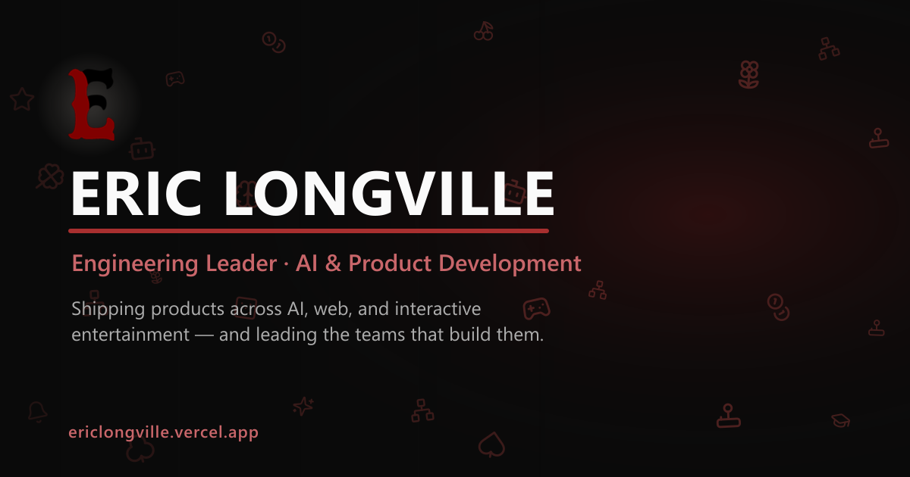

# Eric Longville — Portfolio

A personal portfolio / résumé site for Eric Longville — engineering leader with 14+ years building
AI, web, and interactive-entertainment products, and the teams behind them.



**Live:** https://ericlongville.vercel.app

---

## Tech stack

- **[Next.js 15](https://nextjs.org/)** (App Router) · **React 19** · **TypeScript** (strict)
- **Tailwind CSS** for styling (theme-aware CSS variables)
- **[Framer Motion](https://www.framer.com/motion/)** for animation
- **[lucide-react](https://lucide.dev/)** for icons
- No backend, no database, no test suite — it builds to a static-ish Next app and deploys on Vercel.

---

## Content lives in one place: `config/site.ts`

**`config/site.ts` is the single source of truth for all site content** — name/title/description,
navigation, social links, the home hero, the About page (work experience + skills), Work projects,
AI Projects, project showcases, and the gallery. Pages read from `siteConfig` and render it; they
don't hardcode copy.

So to change text, add a project, swap a photo, or update a link, **edit `config/site.ts`** — not the
page components. For a new image, drop the file in `public/images/…` and reference its `/images/…`
path from the config.

---

## Getting started

Requires **Node 18.18+** (or 20+) and npm.

```bash
npm install       # install dependencies
npm run dev       # start the dev server at http://localhost:3000
```

Other scripts:

```bash
npm run build     # production build — the main correctness gate (type + build errors fail here)
npm run lint      # ESLint (next/core-web-vitals + next/typescript)
npm run start     # serve the production build locally
```

There are no automated tests; QA is `npm run build` + `npm run lint` + a visual check in the browser
(both light and dark themes).

---

## Project structure

```
app/
  layout.tsx            # app shell + site-wide metadata (title template, Open Graph, Twitter)
  page.tsx              # home / hero
  about/                # About page (+ layout.tsx sets the page <title>)
  work/                 # Work index (+ title layout)
  ai-projects/          # AI Projects index (+ title layout)
  gallery/              # Photo gallery (+ title layout)
  showcase/[slug]/      # Dynamic case-study pages, generated from siteConfig.showcases
  icon.png              # favicon (the Longville "E" monogram)
  globals.css           # theme tokens + shared styles
components/              # Navigation, HeroCarousel, WorkCard, ExperimentCard, ShowcaseGallery,
                         # SymbolField (+ symbols.tsx), ThemeProvider
config/site.ts           # ← all site content
public/images/           # local imagery (gallery, work, showcases, AI projects)
public/logo/             # logo assets
public/og.png            # social-share preview image
```

Pages and interactive components are client components (`'use client'`). The exceptions are the
metadata-only **server** files — `app/layout.tsx`, the per-route `layout.tsx` title files, and
`app/showcase/[slug]/page.tsx` — which must not use `'use client'`.

---

## Theming

Light/dark is a `.dark` class toggled on `<html>` by `components/ThemeProvider.tsx`, persisted to
`localStorage`, and defaulting to the OS preference. Colors come from CSS variables defined in
`app/globals.css` (`--background`, `--foreground`, `--card`, `--muted`, `--accent`, `--border`, …).
Style with these tokens (e.g. `bg-[var(--card)]`, `text-[var(--muted-foreground)]`) rather than
hardcoded colors, and define any new color in both the light and `.dark` blocks so both themes stay
correct.

---

## Deployment

Deployed on **[Vercel](https://vercel.com/)**. Import the GitHub repo; Vercel auto-detects Next.js
and needs no extra configuration (build command `next build`, output handled automatically). Every
push to the default branch triggers a production deploy; pull requests get preview deploys.

If the deployment URL changes (e.g. a custom domain), update `siteUrl` / `metadataBase` in
`app/layout.tsx` so Open Graph and canonical URLs stay correct.
